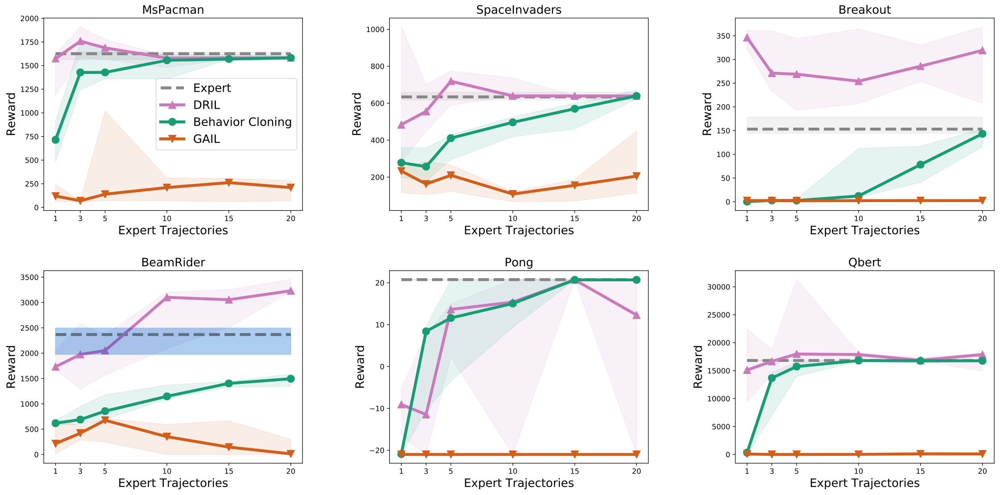
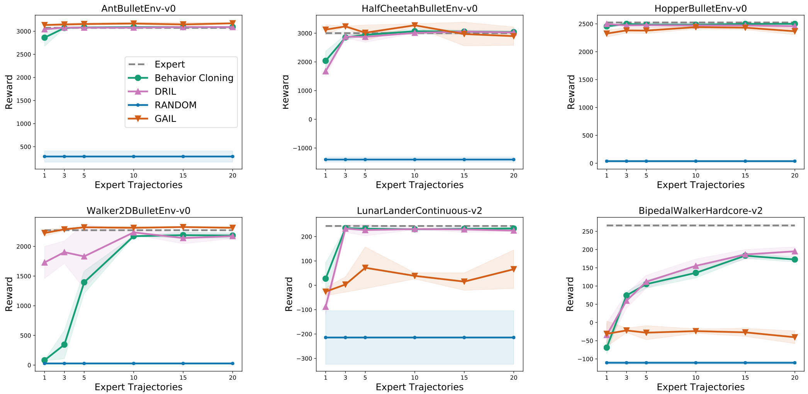

 **Due to a normalization bug the expert trajectories have lower performance than the [rl_baseline_zoo](<https://github.com/araffin/rl-baselines-zoo/blob/master/benchmark.md>) reported experts. Please see the following link in codebase for where the bug was fixed at.** [[link](<https://github.com/xkianteb/dril/blob/e244dcdfca042a3951e98a53864ead33ff6801fc/dril/generate_demonstration_data.py#L96>)]

# Disagreement-Regularized Imitation Learning

Code to train the models described in the paper ["Disagreement-Regularized Imitation Learning"](<https://openreview.net/pdf?id=rkgbYyHtwB>), by Kianté Brantley, Wen Sun and Mikael Henaff.

## Usage:

### Install using pip
Install the DRIL package

```
pip install -e .
```

### Software Dependencies
["stable-baselines"](<https://github.com/hill-a/stable-baselines>), ["rl-baselines-zoo"](<https://github.com/araffin/rl-baselines-zoo>), ["baselines"](<https://github.com/openai/baselines>), ["gym"](<https://github.com/openai/gym>), ["pytorch"](<https://pytorch.org>), ["pybullet"](<https://pypi.org/project/pybullet/>)

### Data

We provide a python script to generate expert data from per-trained models using the ["rl-baselines-zoo"](<https://github.com/araffin/rl-baselines-zoo>) repository. Click ["Here"](<https://github.com/araffin/rl-baselines-zoo/blob/master/benchmark.md>) to see all of the pre-trained agents available and their respective perfromance. Replace ``<name-of-environment>`` with the name of the pre-trained agent environment you would like to collect expert data for. 

```
python -u generate_demonstration_data.py --seed <seed-number> --env-name <name-of-environment> --rl_baseline_zoo_dir <location-to-top-level-directory>
```

### Training
DRIL requires a per-trained ensemble model and a per-trained behavior-cloning model.

**Note that ```<location-to-rl-baseline-zoo-directory>``` is the full-path to the top-level directory to the rl_baseline_zoo repository.**

To train **only** a behavior-cloning model run:
```
python -u main.py --env-name <name-of-environment> --num-trajs <number-of-trajectories> --behavior_cloning --rl_baseline_zoo_dir <location-to-rl-baseline-zoo-directory> --seed <seed-number>'
```

To train **only** a ensemble model run:
```
python -u main.py --env-name <name-of-environment> --num-trajs <number-of-trajectories> --pretrain_ensemble_only --rl_baseline_zoo_dir <location-to-rl-baseline-zoo-directory> --seed <seed-number>'
```

To train a **DRIL** model run the command below. Note that command below first checks that both the behavior cloning model and the ensemble model are trained, if they are not the script will automatically train both the **ensemble** and **behavior-cloning** model.

```
python -u main.py --env-name <name-of-environment> --default_experiment_params <type-of-env>  --num-trajs <number-of-trajectories> --rl_baseline_zoo_dir <location-to-rl-baseline-zoo-directory> --seed <seed-number>  --dril 
```

```--default_experiment_params``` are the default parameters we use in the **DRIL** experiments and has two options: ```atari``` and ```continous-control```

### Visualization
After training the models, the results are stored in a folder called ```trained_results```. Run the command below to reproduce the plots in our paper. If you change any of the hyperparameters, you will need to change the hyperparameters in the plot file naming convention.
```
python -u plot.py -env <name-of-environment>
```

## Empirical evaluation
### Atari
Results on Atari environments.


### Continous Control
Results on continuous control tasks.


## Acknowledgement:
We would like to thank Ilya Kostrikov for creating this ["repo"](<https://github.com/ikostrikov/pytorch-a2c-ppo-acktr-gail>) that our codebase builds on. 
